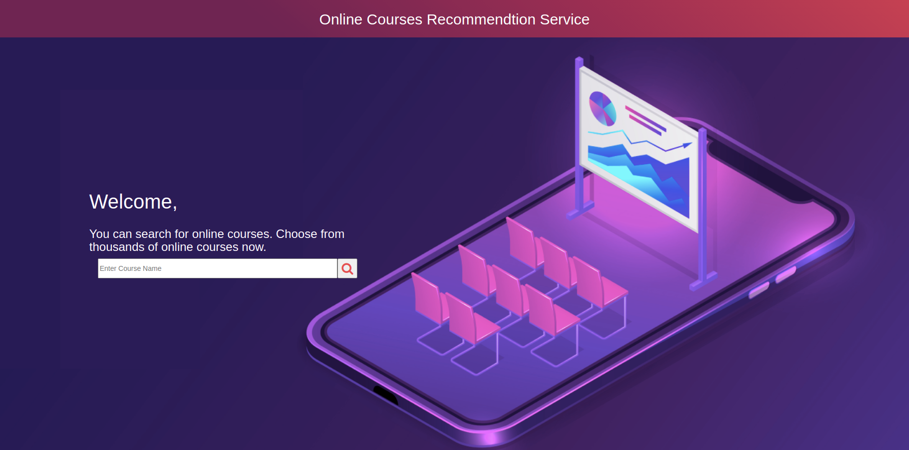
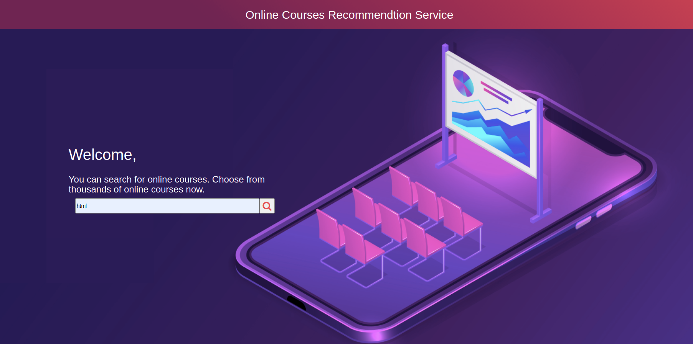
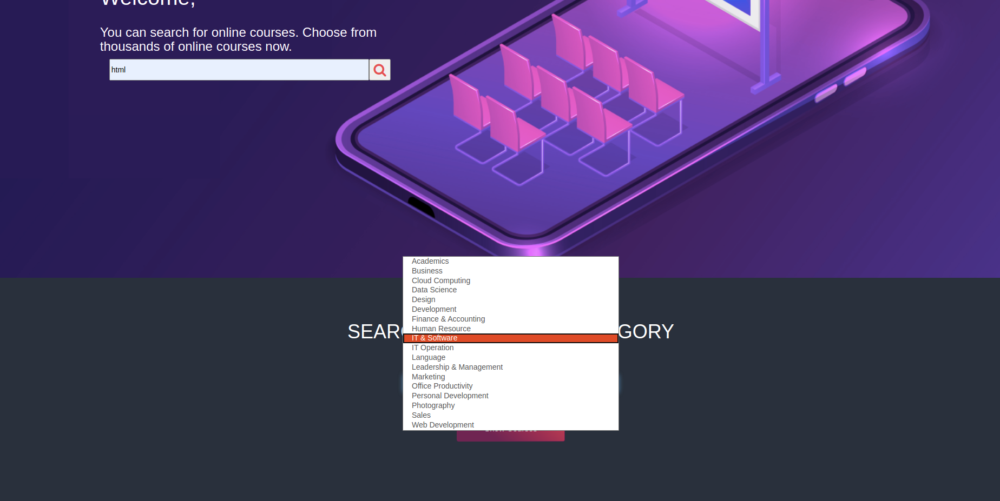
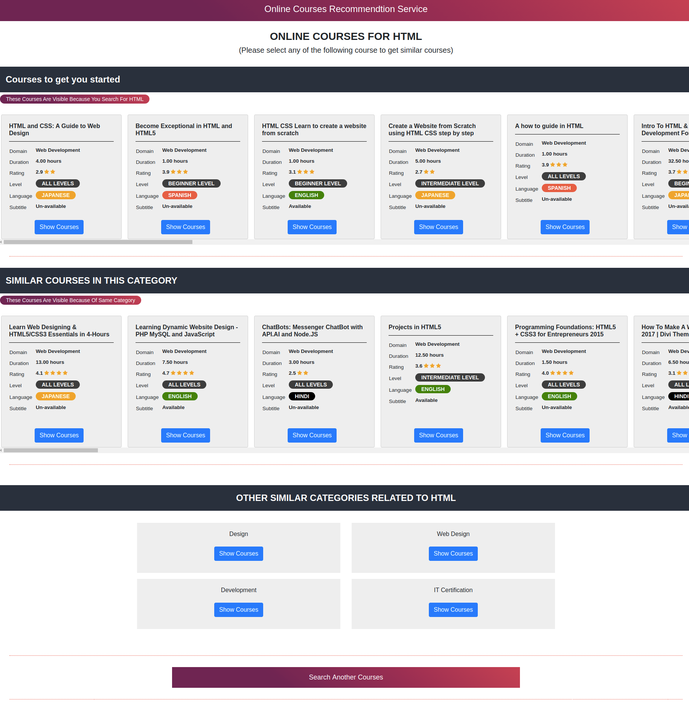
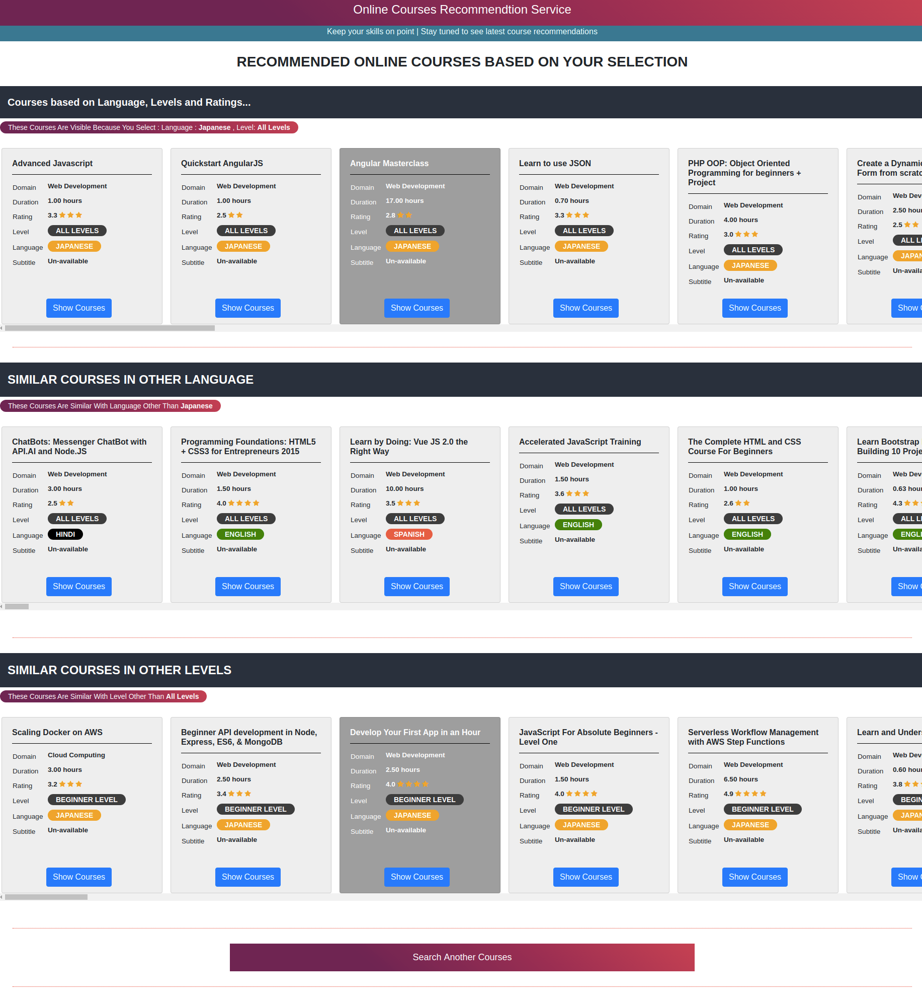

# Online course recommendation system

This is Online course recommendation system built with python Flask framework. This systems operate using a single input, like course keywords or category. 

This system make use of Content-based filtering approach. It utilize a series of discrete, pre-tagged characteristics of online course like course category, language, rating, etc. in order to recommend additional courses with similar properties.

## Installation

### 1. Start docker-compose file with admin privilege
    sudo docker-compose up 

### 2. Open following URL
    http://127.0.0.1:5000/

## Usage example

#### 1. Search for specific course e.g. html, aws, ccna

or you can select category from list

#### 2. Specific courses matching to your keyword will shown to you. 

#### 3. Now select any course, system will give you recommendation related to that course.

#### 4. You can select any course and system will keep showing you courses similar to selected course.

## Technologies Used

1. Framework - Python Flask
2. Front-End - HTML
3. Database - MySQL DB hosted on AWS RDS  

### AWS RDS Connection :  

##### host : 'aws-db.c870dqshvtvk.ap-south-1.rds.amazonaws.com'

##### user : 'admin'

##### password : 'rootadmin'

##### database : 'dataset2'

##### table : udemy_courses